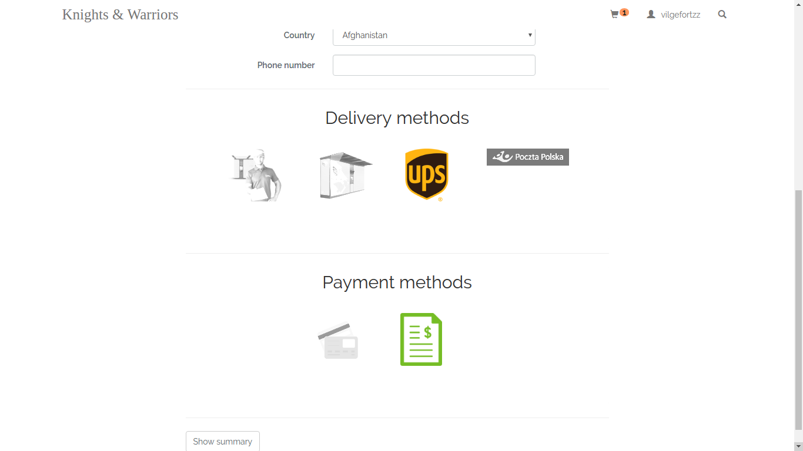
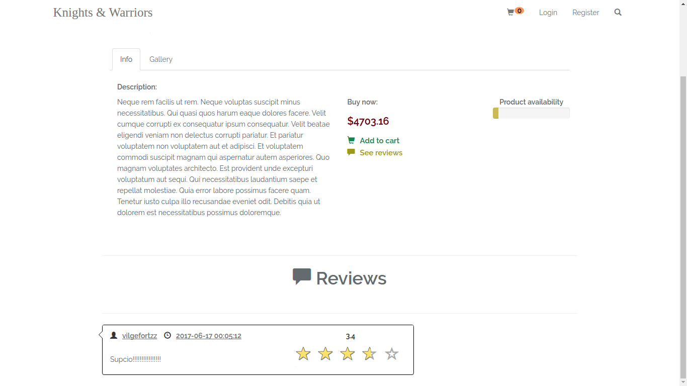

<h1 align="center">E-shop Knights & Warriors</h1>

- add/remove products from cart
- set number of items to buy
- buy products
- see gallery of images
- place an order
- give reviews and ratings
- see your orders history
- live search of products
- admin panel to manage ( change status, change quantity of products on stock)

## Screens from e-shop

Main Page with two categories, navigation bar and footer

Footer with terms and conditions, faq, about us, social media panel and newsletter subscription

Subcategories

Registration panel

Login panel

Products displayed in grid system

Products displayed in list system

Sort products by price - ascending or descending

Product was added to cart - dynamically

Details of products - info and gallery

Gallery of images for product - thumbnails

Gallery of images for product - zoom's effect on thumbnail

Products in cart - dynamically changes in number of items, total prices and prices for products

Place an order - fill data manually or download data from personal information from user

Place an order - choose delivery method and payment ( highlighted images of chosen methods )

Place an order - final checkbox to confirm data and accept terms and conditions and click the button ( disabled on the beggining - after check the checkbox button is available to click )

See orders history - details, status ( is changed via admin panel ), date, ordered products. Filtration by status is available

Giving reviews and ratings after product bought, only once for user for this product 

See reviews and ratings for products given by all users

Live search of products

